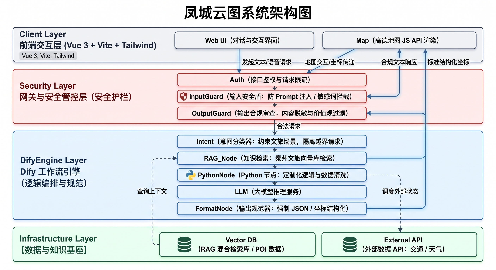

# 🍵 凤城云图 (Fengcheng-Yuntu) · 泰州智能文旅规划系统

凤城云图 是一套专为江苏泰州深度定制的 AI 智能文旅规划与地理可视化系统。
系统融合了 DeepSeek-Chat 大语言模型、Hybrid RAG 混合知识检索（BM25 + ChromaDB + RRF）、高德地图 Web/JS API 空间富化以及实时天气感知引擎，彻底解决了通用大模型在旅行规划中常见的“路线跨区折返、POI 同名漂移、虚假门票与脱离空间坐标”等幻觉问题。

## 🌟 核心特性与创新亮点

- **垂直文旅领域建模（泰州特色数据域）**：深度构建覆盖海陵早茶（皮包水文化/烫干丝/蟹黄汤包/鱼汤面）、海陵古建园林、姜堰溱湖湿地、兴化水上森林与垛田花海的结构化 Markdown 知识库。
- **物理空间防折返与 POI 坐标纠偏机制**：
  - 结构化空间聚类：Prompt 强约束每日行程收敛于同一行政区。
  - 地名噪声正则清洗：自动剥离“早茶/午餐/打卡/自由活动”等动作后缀与括号干扰。
  - 高德中心城区坐标偏置（Location Bias）：注入泰州核心地理坐标锚点与距离排序算法，杜绝“主城区早茶误漂移至 25km 外郊区同名分店”的跨区飞线缺陷。
- **高质量 Hybrid RAG 检索引擎**：
  - 采用 分块标题上下文增强 机制，消除空分块与断裂分块。
  - 结合 jieba 分词 + BM25 关键词匹配 与 ChromaDB 向量相似度，经 RRF (Reciprocal Rank Fusion) 算法融合重排，精准召回地道文旅要点。
- **环境与时令动态感知**：
  - 集成高德实时天气接口，根据降雨/气温自适应调整游览建议（如室内早茶/展馆替补方案）。
  - 具备时令感知能力（如 9 月出行自动调度兴化千垛万寿菊花海而非春季油菜花）。
- **沉浸式双向交互大屏**：
  - 左侧时间轴卡片与右侧高德地图 3D 轨迹深度联动。
  - 支持点击行程节点平滑飞行（map.setZoomAndCenter）聚焦并弹出带真实景图的定制 InfoWindow。
- **完整工程闭环与持久化**：基于 Pydantic v2 严苛契约定义，集成 SQLAlchemy ORM + SQLite，提供历史行程持久化与完整 RESTful CRUD 接口。

## 🏗️ 系统架构图



## 📂 项目工程目录结构

```text
fengcheng-yuntu/
├── .gitignore
├── README.md
├── 框架图.jpg
├── backend/
│   ├── .env.example
│   ├── requirements.txt
│   ├── test_planner.py
│   ├── test_rag.py
│   ├── app/
│   │   ├── __init__.py
│   │   ├── config.py
│   │   ├── database.py
│   │   ├── main.py
│   │   ├── agent/
│   │   │   ├── __init__.py
│   │   │   ├── planner.py
│   │   │   └── prompt_templates.py
│   │   ├── models/
│   │   │   ├── __init__.py
│   │   │   └── trip.py
│   │   ├── rag/
│   │   │   ├── __init__.py
│   │   │   ├── hybrid.py
│   │   │   └── vector_db.py
│   │   ├── routes/
│   │   │   ├── __init__.py
│   │   │   ├── history.py
│   │   │   └── trip.py
│   │   ├── schemas/
│   │   │   ├── __init__.py
│   │   │   └── trip.py
│   │   └── services/
│   │       ├── __init__.py
│   │       ├── map_service.py
│   │       └── weather_service.py
│   └── data/
│       └── guides/
│           ├── hailing_and_gaogang_depth.md
│           ├── morning_tea_and_culture.md
│           ├── taixing_and_jingjiang.md
│           ├── taizhou_food_and_routes.md
│           ├── wetland_and_ecology.md
│           └── xinghua_culture_and_shagou.md
└── frontend/
    ├── index.html
    ├── package.json
    ├── package-lock.json
    ├── postcss.config.js
    ├── tailwind.config.js
    ├── vite.config.js
    ├── public/
    │   ├── favicon.svg
    │   └── icons.svg
    └── src/
        ├── App.vue
        ├── main.js
        ├── style.css
        ├── api/
        │   └── trip.js
        ├── assets/
        │   ├── hero.png
        │   ├── vite.svg
        │   └── vue.svg
        └── components/
            ├── HelloWorld.vue
            └── MapView.vue
```

## 🚀 快速启动指南

### 1. 环境准备

- Python: 3.11（推荐）或 3.10
- Node.js: 18.x 或更高版本

### 2. 后端服务部署 (FastAPI)

进入后端目录并创建虚拟环境：

```bash
# 1. 进入后端目录
cd backend

# 2. 创建并激活 Python 虚拟环境 (Windows PowerShell)
python -m venv venv
.\venv\Scripts\Activate.ps1
# 或 Windows CMD: .\venv\Scripts\activate.bat
# 或 Linux/macOS: source venv/bin/activate

# 3. 安装依赖包
pip install -r requirements.txt

# 4. 配置环境变量
copy .env.example .env     # Linux/macOS 使用: cp .env.example .env
```

### 3. 在 backend/.env 中配置对应的 API 密钥

```ini
PROJECT_NAME="凤城云图 (Fengcheng-Yuntu)"
# DeepSeek API 配置
DEEPSEEK_API_KEY="sk-your-deepseek-api-key"
DEEPSEEK_BASE_URL="https://api.deepseek.com"
LLM_MODEL_NAME="deepseek-chat"

# 高德开放平台 Web 服务 Key (用于后端 POI 检索与天气)
AMAP_WEB_KEY="your-amap-web-key"
ENABLE_AMAP_ENRICHMENT=true

# 数据库配置
DATABASE_URL="sqlite:///./fengcheng.db"
```

### 4. 启动后端服务

```bash
uvicorn app.main:app --reload --port 8000
```

### 5. 前端服务启动 (Vue 3 + Vite)

```bash
# 1. 进入前端目录
cd frontend

# 2. 安装前端依赖
npm install

# 3. 启动开发服务器
npm run dev
```
